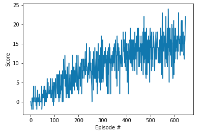

# Report: "Project 1 - Navigation"

We will train a DeepRL agent to solve a Unity Environment.

## Architecture

## Code

The code is written in PyTorch and Python 3.

Main Files:  

1. Banana.app
   This app will simulate the Unity environment.
2. dgq_agent.py
   This code defines the agent.
3. model.py
   This code defines de model of Neural Network architecture.
4. Train-Unity-ML-Agent.ipynb
   This notebook will train the agent.
5. checkpoint.pth
   Saved model weights of the successful agent.

## Learning Algorithm

### Hyper Parameters

### Neural Network - Model Architecture

### Plot of Rewards

Environment solved in 547 episodes!	Average Score: 15.01

A plot of rewards per episode is included to illustrate that the agent is able to receive an average reward (over 100 episodes) of at least +15.

Video of Training:

-----------------
Report

The submission includes a file in the root of the GitHub repository (one of Report.md, Report.ipynb, or Report.pdf) that provides a description of the implementation.

Learning Algorithm

The report clearly describes the learning algorithm, along with the chosen hyperparameters. It also describes the model architectures for any neural networks.

Plot of Rewards

A plot of rewards per episode is included to illustrate that the agent is able to receive an average reward (over 100 episodes) of at least +13. The submission reports the number of episodes needed to solve the environment.

Ideas for Future Work

The submission has concrete future ideas for improving the agent's performance.

Suggestions to Make Your Project Stand Out!
Include a GIF and/or link to a YouTube video of your trained agent!
Solve the environment in fewer than 1800 episodes!
Write a blog post explaining the project and your implementation!
Implement a double DQN, a dueling DQN, and/or prioritized experience replay!
For an extra challenge after passing this project, try to train an agent from raw pixels! Check out (Optional) Challenge: Learning from Pixels in the classroom for more details.